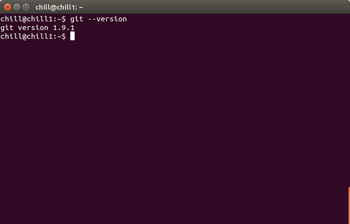

# Git Basics

Hi there! This file contains a basic guide for using [Git](https://git-scm.com/) and [GitHub](https://github.com/). If you have never used either of those before, that's ok, this guide is suitable for total beginners. Let's get started.

## What is Git?

Git is a computer program that creates a history of changes to files. This is useful (and often necessary) because it allows programmers to easily organize and track changes to the software that they create.

## Install Git

First you will need to install Git on your computer. You can download an installer for your system [here](https://git-scm.com/downloads). While you are downloading the installer, you can move on to the [next section](#github-account).

## GitHub Account

GitHub is a social coding platform used by many [open source](https://opensource.org/) projects. [Sign up](https://github.com/join) for a free GitHub account so that you can contribute to existing projects (or start your own projects).

Once you have setup your GitHub account, go back to the [previous section](#install-git) and finish installing Git.

## Using Git

To use Git, we will use a command-line interface instead of a graphic interface.

For Windows:
* Open your Start Menu and search for "git bash".
* You should see a program named "Git Bash".
* Open the git bash program.
* Type the command `git --version` and hit enter.
* The result should be something like this:

For Mac or Linux:
* Open your Terminal program.
* Type the command `git --version` and hit enter.
* The result should be something like this:

If you had any trouble with the previous steps, please ask for help and we will get you back on track.

Now we will try some [basic Git commands](https://docs.gitlab.com/ee/gitlab-basics/start-using-git.html#basic-git-commands).
